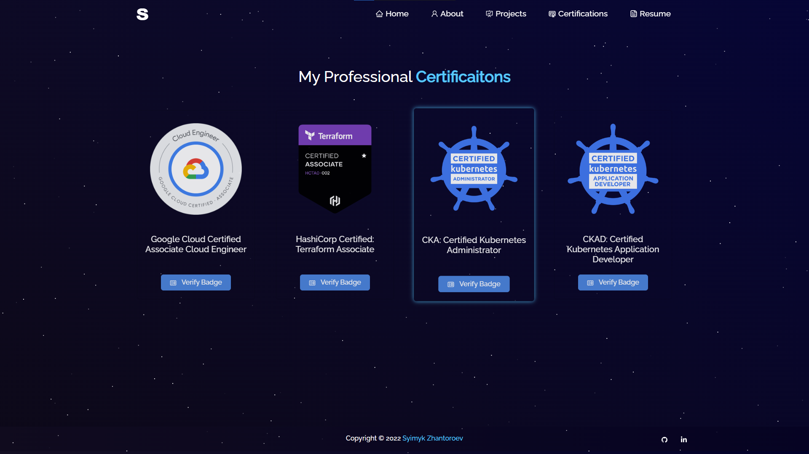
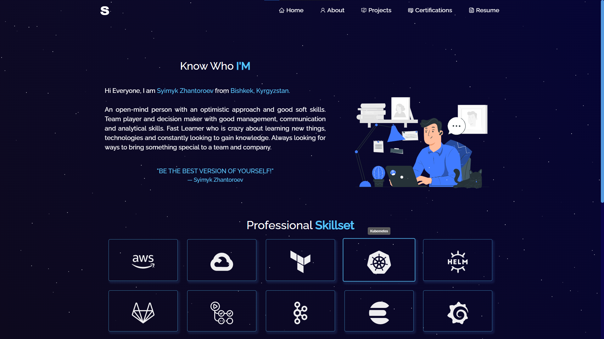
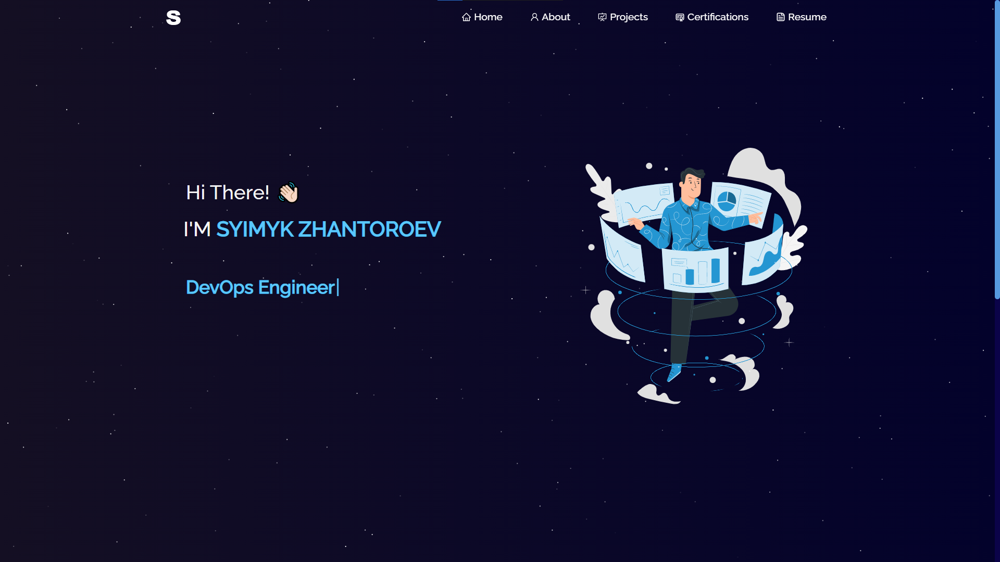

<h1 align="center"> 
    Hello, all! 👋
</h1>

I am Syimyk Zhantoroev. Senior DevOps Engineer at Ant Tech.

As a seasoned DevOps Engineer, I have honed my skills and abilities over the years to become a 
highly competent and versatile professional. I am committed to delivering secure and innovative 
solutions that cater to the specific needs of any organization I work with. I take pride in 
continuously improving my skills and knowledge to ensure that I provide cutting-edge solutions.

Aside from my technical expertise, I excel in decision-making, teamwork, and communication. I value 
collaboration and believe that open communication is key to successful project outcomes.

During my free time, I enjoy exploring Javascript libraries and frameworks such as React.js, Express.js, 
and Node.js to develop new products and expand my skill set.

<h2 align="center"> 
    Personal Portfolio  
    <a href="https://www.zhantoroev.ml" target="_blank">zhantoroev.ml</a>
</h2>
Few screenshots from the website:

  
  
  

